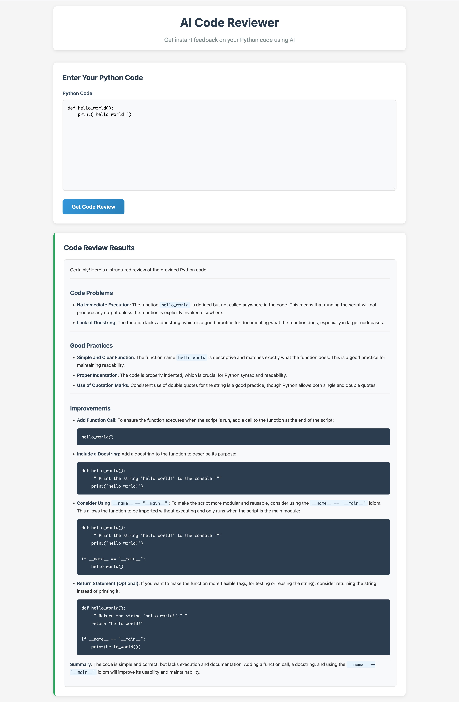

# AI Code Reviewer

A simple web application that provides AI-powered code reviews for Python code using OpenAI-compatible APIs.

## Features

- **Simple Web Interface**: Clean, responsive interface for code input and review display
- **AI-Powered Reviews**: Uses OpenAI-compatible APIs to provide structured code feedback
- **Real-time Feedback**: Instant code analysis with loading states and error handling
- **Responsive Design**: Works on desktop and mobile devices
- **No Registration Required**: Simple, one-time use without user accounts
- **Flexible API Support**: Works with OpenAI and other OpenAI-compatible services
- **Containerized Deployment**: Ready-to-deploy Docker container with nginx and FastAPI
- **Production Ready**: Optimized nginx configuration with process management

## Screenshot



## Quick Start

### Option 1: Docker Deployment (Recommended)

#### Prerequisites
- Docker and Docker Compose

#### Installation & Running

1. Clone the project:
```bash
git clone https://github.com/dev-wantap/ai-code-reviewer.git
cd ai-code-reviewer
```

2. Set up environment variables:
```bash
# Copy the example .env file and configure your API settings
cp .env.example .env
# Edit .env with your API key and preferred settings
```

3. Build and run with Docker Compose:
```bash
# Build and start the container
docker-compose up --build

# Or run in background
docker-compose up -d --build
```

4. Open your browser and navigate to:
```
http://localhost
```

#### Alternative Docker Commands

```bash
# Build the image manually
docker build -t ai-code-reviewer .

# Run the container
docker run -p 80:80 --env-file .env ai-code-reviewer

# Stop the container
docker-compose down
```

### Option 2: Local Development

#### Prerequisites
- Python 3.8 or higher
- uv package manager (recommended) or pip

#### Installation

1. Clone the project:
```bash
git clone https://github.com/dev-wantap/ai-code-reviewer.git
cd ai-code-reviewer
```

2. Install dependencies:
```bash
# Using uv (recommended)
uv sync

# Or using pip
pip install -r requirements.txt
```

3. Set up environment variables:
```bash
# Copy the example .env file and configure your API settings
cp .env.example .env
# Edit .env with your API key and preferred settings
```

#### Running the Application

1. Start the server:
```bash
# Using uv (recommended)
uv run main.py

# Or using python directly
python main.py
```

2. Open your browser and navigate to:
```
http://localhost:8000
```

3. Enter your Python code in the textarea and click "Get Code Review"

## Usage

1. **Enter Code**: Paste or type your Python code into the text area
2. **Submit**: Click "Get Code Review" or press Ctrl/Cmd + Enter
3. **View Results**: The AI will analyze your code and provide feedback covering:
   - Code problems and bugs
   - Good practices identified
   - Specific improvement suggestions

## API Endpoints

### GET /
- Returns the main web interface (index.html)

### POST /review
- **Request Body**: `{"code": "your_python_code"}`
- **Response**: `{"review": "ai_generated_review"}`
- **Errors**: 
  - 400: Empty code input
  - 500: API service errors

## Project Structure

```
ai-code-reviewer/
├── Dockerfile           # Multi-stage Docker build
├── docker-compose.yml   # Docker Compose configuration
├── nginx.conf           # nginx reverse proxy configuration
├── supervisord.conf     # Process management configuration
├── main.py              # FastAPI application and API endpoints
├── static/
│   ├── index.html       # Web interface
│   ├── style.css        # Styling and responsive design
│   └── script.js        # Client-side logic and API calls
├── .env                 # Environment variables
├── pyproject.toml       # Project dependencies
└── README.md           # This file
```

## Technology Stack

- **Containerization**: Docker with nginx:alpine base image
- **Reverse Proxy**: nginx for static file serving and API proxying
- **Process Management**: Supervisor for managing multiple processes
- **Backend**: FastAPI with Uvicorn ASGI server
- **Frontend**: Vanilla HTML, CSS, and JavaScript
- **AI Service**: OpenAI-compatible APIs via OpenAI client library
- **Environment**: python-dotenv for configuration

## Configuration

The application uses the following environment variables:

- `OPENAI_API_KEY`: Your OpenAI API key or compatible service API key
- `OPENAI_BASE_URL`: Base URL for the API (default: https://api.openai.com/v1)
- `OPENAI_MODEL`: Model to use for code reviews (default: gpt-3.5-turbo)

### Example Configuration

**OpenAI:**
```bash
OPENAI_API_KEY=your_openai_api_key
OPENAI_BASE_URL=https://api.openai.com/v1
OPENAI_MODEL=gpt-3.5-turbo
```

**Other OpenAI-compatible services:**
Configure the base URL and model according to your service provider's documentation.

## Keyboard Shortcuts

- `Ctrl/Cmd + Enter`: Submit code for review
- `Escape`: Clear error messages

## Troubleshooting

### Development Mode

For development, you can run with auto-reload:

```bash
uvicorn main:app --reload --host 0.0.0.0 --port 8000
```

## Security Notes

- API key is stored in environment variables
- Input validation on both client and server sides
- No sensitive data storage or user authentication required
- CORS configured for same-origin requests

## License

This project is provided as-is for educational and demonstration purposes.